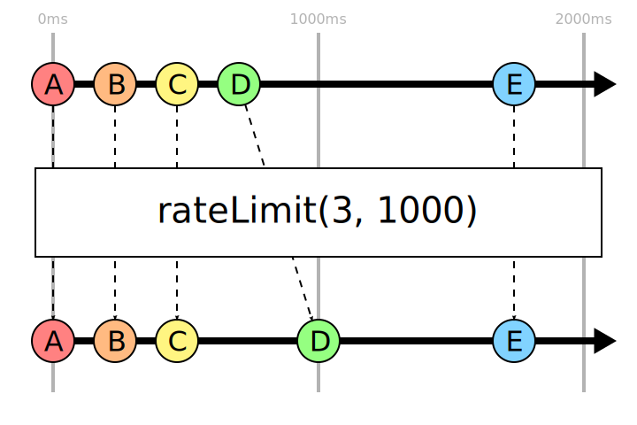

An operator for RxJS 6+ that applies rate limiting as seen on many HTTP APIs.

## rateLimit()

Given a `limit` and a `window`, only emit `limit` items within a rolling `window` duration. Extra items are delayed until the window is no longer full.



## Example

```ts
import { rateLimit } from "rxjs-ratelimit-operator";

// Send no more than 120 requests per minute
request$.pipe(rateLimit(120, 60000)).subscribe(sendRequest);
```
